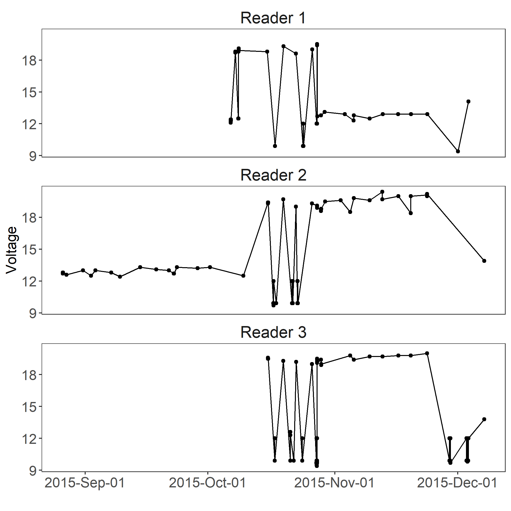

```{r setup, include = FALSE}
knitr::opts_chunk$set(
  collapse = TRUE,
  comment = "#>"
)

# Only use for checking development; comment out when submitting to github
# devtools::load_all()

```

Passive integrated transponder (PIT) telemetry has become a universal tool to study, monitor, and manage fish populations. One major challenge with PIT telemetry is data management. PIT telemetry produces large and complex datasets that can be challenging to collate and clean from raw formats without specialized expertise in data manipulation and management. To address this, we aimed to develop an efficient, standardized, and user-friendly tool to manage PIT telemetry data. PITR is an open source R package that is designed to automate and standardize the process of collating, managing, summarizing, and querying PIT telemetry data collected from half-duplex Oregon RFID readers. We hope that this analysis tool will provide significant time and cost savings to PIT users worldwide and standardize methods to encourage collaboration and integration of datasets from different projects and regions. 

Generally there are three main families of functions in PITR:

1. Data collation: these functions combine raw data from multiple readers and clean data to filter out test tags and include tags specific to a study.
2. Data management: this function allows you to restructure the configuration of readers and antennas into single or multiple arrays prior to summarizing or further query.
3. Data summary: these functions provide information on detection efficiency of antennas or arrays, direction, and characteristics of movement, and plot the voltage of each reader to better inform power management. You can choose to summarize data by year, month, week, day, or hour, and subset specific periods of time.

## Load the package

```{r eval = FALSE}
install.packages("devtools")
library(devtools)
install_github("InStreamFisheries/PITR")
library(PITR)
```

## Data collation

Manually collating data can be time consuming for studies in complex river systems with large arrays and sample sizes. Consequently, the collation of data is often subject to significant human error. To avoid this, PITR allows you to collate any number of individual raw downloads (i.e., text files) located in a working directory.

Data collected from Oregon RFID readers may have different formats depending on the firmware version of the unit. Use of the `old_pit` and `new_pit` functions corresponds to data collected from earlier firmware versions (pre-April 2014) or more recent ones (post-April 2014), respectively.

Raw data from different reader formats must be stored in separate working directories. For example, if you have "old" PIT data from a study that needs to be collated, first you must define the working directory where the "old" files are located:

```{r eval = FALSE}
old <- "./Old PIT Data/"
```

Data files must be named in the following format: "pit_reader_mm_dd_yyyy.txt". Note that "pit_reader" is the unique name of the individual reader (e.g., site name or river distance) - this populations the "reader" column in the final dataset. The full text string "_mm_dd_yyyy.txt" must follow the reader name.

You can also remove test tags from the dataset that you do not want to see in data summaries. Test tags are often used to confirm antenna functionality and read range throughout its operation. If, for example, you had three test tags in a particular study, you can create a concatenated list of test tags to be removed from the final dataset:

```{r}
tt <- c("900_230000010075", "900_230000010079", "900_230000010080")
```

Note that these tag codes are complete - i.e., "900_230000010075", and not "10075". You can also include a data frame called "study tags" in .csv or .txt format (i.e., study_tags.csv or study_tags.txt) in the working directory that contains the full list of tags you want to subset out of the collated dataset. Note that the list of study tags needs to be in one column named "study_tags". If no data frame of study tags exists in the working directory, it is assumed that no study-specific tags need to be subsetted out of the dataset.

Now you can run the `old_pit` function to collate the data:

```{r  eval = FALSE}
old_dat <- old_pit(data = old, test_tags = tt, print_to_file = FALSE, time_zone = "America/Vancouver")
```

To collate new format data, you must also define the working directory where the "new" files are located. If you only have "new" data, you would start the data collation process at this step:

```{r  eval = FALSE}
new <- "./New PIT Data/"
```

You can now run the `new_pit` function. 

```{r  eval = FALSE} 
new_dat <- new_pit(data = new, test_tags = tt, print_to_file = FALSE, time_zone = "America/Vancouver")
```

If the `print_to_file` argument is set to TRUE, the function will export meta-data (error messages, reader voltages, etc) to the working directory to help confirm that data collation was performed correctly. 

You can also choose to specify the time zone where data were collected in the rare event that it is different than the time zone in which the analysis is taking place. Note that Wikipedia has a list of time zones in the tz database.

The output from the `new_pit` and `old_pit` functions is a list of data frames. The master data frame of collated data is accessed using `new_dat$all_det`. See individual help files for `new_pit` and `old_pit` for a full description of the lists returned.

Note that in previous versions of PITR (V 1.0.0), an argument in `new_pit` called `old_format_data` allowed users to bring old format data into the final data frame within the `new_pit` call. This is depreciated and users must now manually combine data from different formats. For example:

```{r  eval = FALSE}
all_dat <- rbind(old_dat$all_det, new_dat$all_det)
```

## Data management

Depending on the initial setup of the antennas and arrays, you may have to restructure the configuration of antennas, readers, and arrays after the data has been collected. You can use the `array_config` function to:

1. Combine unique readers into an array;
2. Split readers with multiple antennas into single readers; and/or
3. Rename up to four antennas on one reader or one array.

Use of this function allows you to configure antenna and array hierarchy and order in preparation for summary and further analyses. A summary of the current array, reader, and antenna configuration is printed to screen after each use of the `array_config` function to inform you of the changes that have occurred.

An example restructuring would be a large-scale project in a mainstem river and its tributaries that has multiple PIT arrays and tagged populations and/or species. You can isolate specific tag codes during data collation (if desired), use the `array_config` function to group antennas into arrays and then use the `det_eff` function (see below) to determine the detection efficiency of arrays encountered by the subset of tags. 

Let's look at a simple example that uses the `array_config` function with a small dataset. First load the test dataset included in the PITR package that contains detections from a multi reader with two antennas:

```{r}
oregon_rfid <- new_pit(data = "oregon_rfid", test_tags = NULL, print_to_file = FALSE, time_zone = "America/Vancouver")

head(oregon_rfid)
```

You can use the `configuration` argument to "split" the data collected from the multi reader into two single readers:

```{r}
split <- array_config(data = oregon_rfid, configuration = "split", reader_name = "dam", new_reader_1_antennas = "1")
```

Note that the `array_config` function automatically assigns array names that are the same as the reader names. In this example, we want to recombine these two single readers into an array called "fishway" using the `configuration` argument. We can use the argument "combine" to do this:

```{r}
combine <- array_config(data = split, configuration = "combine", array_name = "fishway", r1 = "dam_1", r2 = "dam_2")
```

You can also rename antennas using "rename_antennas" in `array_config`. Many of the PITR summarizing functions (e.g., direction of movement, detection efficiency) are designed to describe data where antennas are numbered sequentially from dowstream to upstream (i.e., the most downstream antenna should be antenna 1). You may need to use `array_config` if antenna numbers need to be adjusted, single reader data are present (antenna number will be NA for single reader data), or antennas were not wired correctly on the terminal strip of the a reader. Lets rename antenna 1 to antenna 3 as an example:

```{r}
rename_one <- array_config(data = combine, configuration = "rename_antennas", array_name = "fishway", ao1  = 1, an1 = 3)
```

Then rename antenna 2 to antenna 4:

```{r}
rename_two <- array_config(data = rename_one, configuration = "rename_antennas", array_name = "fishway", ao1 = 2, an1 = 4)
```

In this example we have performed the renaming iteratively, which is helpful to verify that renaming is happening correctly. We can rename up to four antennas using one call of `array_config`. For example, we can combine the two calls above:

```{r}
rename_multiple <- array_config(data = combine, configuration = "rename_antennas", array_name = "fishway", ao1  = 1, an1 = 3, ao2 = 2, an2 = 4)
```

Depending on the setup of the study, you may need to run the `array_config` function several times in an iterative fashion. PIT telemetry studies can be complex and it is important to carefully outline and adjust the naming of antennas and arrays before using the summary functions described below. 

## Data summary

The PITR data summary functions are designed to help guide you through the initial exploratory phase of data analysis and provide tools for in-season management and upkeep of arrays. Data outputs from these functions can be expanded on and further analyzed to suit the needs of the study. You can use the `resolution` argument to summarize data by year, month, week, day, hour, or across the entire time period present in the dataset. Specific time periods can be isolated through the use of the `start_date` and `end_date` arguments.

### Detection efficiency

You can use the `det_eff` function to compute the detection efficiency of antennas or arrays based on the array configuration and your assumption of the direction of fish movement (i.e., upstream, downstream, or resident species). One application of this function might be to determine times during which detection efficiency decreased during the course of a study to help inform in-season antenna maintenance and tuning.

You can compute detection efficiency by month for fish assumed to be moving upstream through a river. Remember that before you run this function you must ensure that antennas are named sequentially from 1 (the most downstream antenna) to x (the most upstream antenna):

```{r}
month <- det_eff(data = oregon_rfid, resolution = "month", by_array = FALSE, direction = "up")
```

Data output:

```{r}
head(month)
```

Detection efficiency has been computed for each unique month for A1 based on shared and missed detections with A2. You would need an antenna upstream of A2 (fish would be moving "up" from A1 through A3) to compute the efficiency of A2. Note that in the above data output detection efficiency for A1 on 2016-05-01 was not computed because there were no detections on A2.

Now compute detection efficiency by week for fish assumed to be moving upstream with a start date of 2016-10-11 08:45:00:

```{r}
week <- det_eff(data = oregon_rfid, resolution = "week", by_array = FALSE,      direction = "up", start_date = "2016-10-11 08:45:00")
```

Data output:

```{r}
head(week)
```

In the above examples we used `det_eff` to determine detection efficiency on a single array with multiple antennas (`by_array = FALSE`). You can also calculate detection efficiency by array instead of by antenna (`by_array = TRUE`). For example, you are studying an upstream migration in a river that contains two, two-antenna arrays. As fish migrate up through the river, they first encounter an array in a dam ("array_one_fishway"), then encounter a second array when they reach their spawning tributary ("array_two_tributary"). We can calculate detection efficiency for the above array configuration by specifying the array sequence from downstream to upstream using the `array_sequence` argument:

```{r  eval = FALSE}
det_eff(data = multi_array, resolution = "month", by_array = TRUE, array_sequence = c("array_one_fishway", "array_two_tributary"), direction = "up")
```

In the above example we did not need to ensure antenna numbers within the arrays were sequential because we were calculating detection efficiency for arrays; however, it is always good practice to number antennas sequentially within a study. If we number the two antennas in "array_one_fishway" A1 and A2, and the antennas in "array_two_tributary" A3 and A4, we can correctly calculate detection efficiency by array or by antenna. Other PITR summary functions use antenna number (e.g., `direction()`, `first_last()`), so it is prudent to correctly number antennas and name arrays prior to performing any data summaries.

### Direction of movement

You can use the `direction` function to determine the direction of movement of individual tags if there were two or more antennas deployed in a study. In the data output, there will be a direction of travel for every instance that a tag is detected by an antenna accross the study duration. Data outputs from this function can highlight the stage of a migration (i.e., early or late, timing of kelting), problematic areas in fishways, locations of tagged fish relative to array(s) for mark-recapture modelling, and other applications.

Example:

```{r}
dir <- direction(data = oregon_rfid)
```

Data output:

```{r}
head(dir)
```

### First and last detections on each antenna

You can use the `first_last` function to summarize the first and last detections and the difference in time (in minutes and days) between the first and last detections on each unique antenna. In the data output, there will be a single row for each tag detected by each antenna that summarizes the first time the tag was detected by the antenna, the last time the tag was detected by the antenna, and the time difference between the first and last detections. Such a function can assist in determining residence time between unique antennas. 

For example, you can summarize data by week with a start date of 2015-10-15 08:00:00:

```{r}
fi_la <- first_last(data = oregon_rfid, resolution = "week", start_date = "2015-10-15 08:00:00")
```

Data output:

```{r}
head(fi_la)
```

### Summarize movements accross arrays

You can use the `direction_total` function to summarize the direction of the first and last movements on each *array* over a user-defined period of time (as opposed to summarizing by antenna in `direction_total()`). In the data output, there will be a single row for each tag on each array that summarizes the first time the tag was detected by the array, the last time the tag was detected by the array, and the time difference between the first and last detections. 

Example:

```{r}
dir_total <- direction_total(data = oregon_rfid, resolution = "year")
```

Data output:

```{r}
head(dir_total)
```

### Voltage of readers

You can use the `volt_plot` function to plot the voltage of each reader over the study duration and save it to the working directory. Such information will help identify power outages or patters of low voltage from solar- and battery-powered installations. Note that the voltage subset (object called "volt_dat") is created using the `new_pit` function and can be managed separately by experienced users.

Here is an example:

```{r  eval = FALSE}
volt_plot(reader_dat$volt_dat)
```

```{r echo = FALSE, out.width = '50%'}

```

## Further resources

PITR's help documentation provides more details on the functions and their associated arguments. Bugs and requests can be submitted to the PITR issues page on GitHub. PIT telemetry data and studies are complex and we envision that PITR will evolve over time based on feedback from users. We encourage any comments and suggestions.
